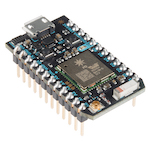
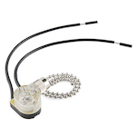
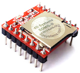
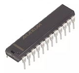
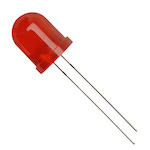
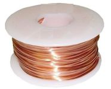
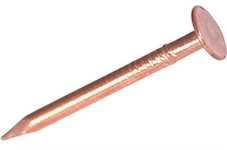

# Rotary-Clock

## Hardware
1x [Particle Photon Wi-Fi Microcontroller](https://store.particle.io/products/photon)

1x[Pull chain Switch](https://www.sparkfun.com/products/retired/11136)

1x[SOMO-II Sound Module ](http://www.4dsystems.com.au/product/SOMO_II/)

2x [MAX7219 LED Driver](http://www.digikey.com/products/en?keywords=MAX7219CNG%2B-ND)

109x [10mm Red Diffused LED](http://www.ebay.com/itm/50pcs-LED-10mm-Red-Color-Red-Light-Diffused-Round-Top-Light-Emitting-Diodes-USA-/122017197469?hash=item1c68caad9d)

1x [22 AWG Bare Copper Wire](https://www.mcmaster.com/#8873k19/=1644fnh)

218x [1-1/4" Copper nails](https://www.mcmaster.com/#97952a101/=1644ghc)

## Software Tools

- [MIT App Inventor 2](http://ai2.appinventor.mit.edu/)
- [Particle Desktop IDE](https://www.particle.io/products/development-tools/particle-desktop-ide)
